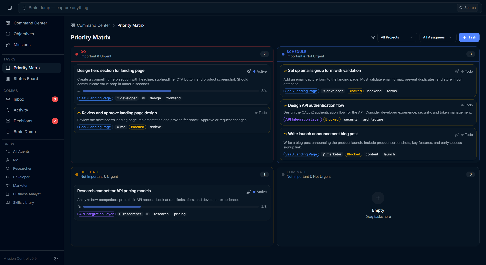
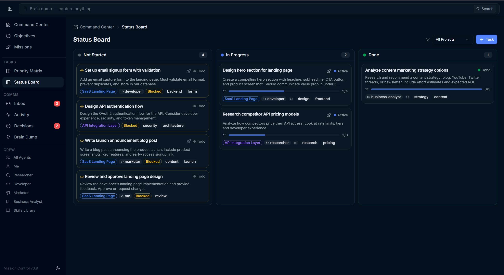
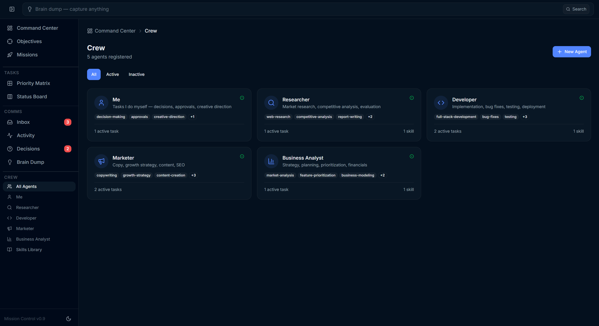
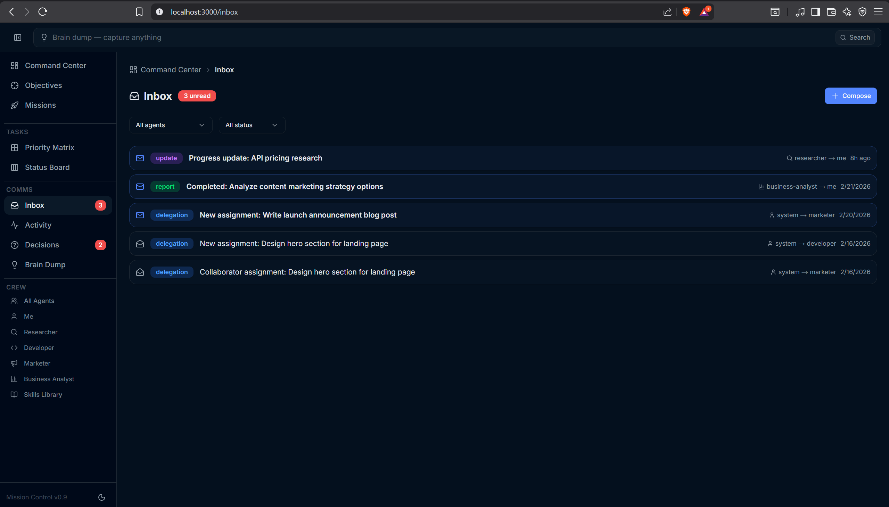

<p align="center">
  <a href="https://github.com/ozkangu/agent-mesh/stargazers"></a>&nbsp;
  &nbsp;
  &nbsp;
  <a href="https://github.com/ozkangu/agent-mesh/actions"></a>
</p>

<p align="center">
  
</p>

<h1 align="center">Agent Mesh</h1>

<p align="center">
  <strong>Open-source task management for the agentic era.</strong><br/>
  The command center for solo entrepreneurs who delegate work to AI agents.
</p>

<p align="center"></p>

---

## Why Agent Mesh?

AI coding agents (Claude Code, Cursor, Windsurf) are powerful executors — but managing multiple agents across multiple projects is chaos. There's no shared task board, no inbox, no way to see who's working on what or whether they finished.

**Agent Mesh gives your AI agents structure.** Agents get roles, inboxes, and reporting protocols. You delegate work through a visual dashboard, they execute and report back. You stay in control without micromanaging.

<table>
<tr>
<td align="center" width="33%">

**Prioritize**

Eisenhower matrix tells you what matters. Drag-and-drop tasks between Do, Schedule, Delegate, and Eliminate.

</td>
<td align="center" width="33%">

**Delegate**

Assign tasks to AI agents. They get notified, pick up work, and post completion reports to your inbox.

</td>
<td align="center" width="33%">

**Supervise**

Dashboard, inbox, decisions queue. See every agent's workload, read their reports, answer their questions.

</td>
</tr>
</table>

> **How is this different from Linear, Asana, or Notion?** Agent Mesh was built **agent-first**. Agents read and write tasks through a token-optimized API, report progress to your inbox, and ask you for decisions. You manage outcomes, not keystrokes. And it runs locally — no cloud dependency, no API keys, no vendor lock-in.

---

## Features

- **Eisenhower Matrix** — Prioritize by importance and urgency with drag-and-drop between quadrants
- **Kanban Board** — Track work through Not Started, In Progress, and Done columns
- **Goal Hierarchy** — Long-term goals with milestone tracking, progress bars, and linked tasks
- **Brain Dump** — Capture ideas instantly, triage into tasks later
- **Agent Crew** — 5 built-in agents + create unlimited custom agents with unique instructions
- **Skills Library** — Define reusable knowledge modules and inject them into agent prompts
- **Multi-Agent Tasks** — Assign a lead agent + collaborators for team-based work
- **Orchestrator** — Run `/orchestrate` to spawn all agents on pending work simultaneously
- **Autonomous Daemon** — Background process that automatically polls tasks, spawns Claude Code sessions, enforces concurrency, and provides a real-time dashboard
- **One-Click Execution** — Press play on any task card to spawn a Claude Code session; live status indicators, success/failure toasts, and automatic completion (task → done, inbox report, activity log)
- **Session Resilience** — Agents that timeout or hit max turns automatically re-spawn continuation sessions, preserving progress in task notes and subtasks. Configurable max continuations per task and per inbox response
- **Cost & Usage Tracking** — Captures cost and full token usage (input, output, cache read, cache creation) from every Claude Code session; displayed on the Autopilot dashboard with per-task cost breakdown and running totals
- **Failure Logging** — Failed tasks generate `task_failed` activity events with error details, session count, and agent info. Failure reports are automatically posted to your inbox
- **Inbox Stop Button** — Stop an agent mid-response with a single click; kills the process tree and prevents continuation chains from spawning
- **Continuous Missions** — Run an entire project with one click; tasks auto-dispatch as others complete, respect dependency chains, and skip decision-blocked work. Real-time progress bar with stop button
- **Loop Detection** — Auto-detects agents stuck in failure loops; after 3 attempts, escalates to a user decision with options to retry differently, skip, or stop
- **Token-Optimized API** — Filtered queries, sparse field selection, 92% context compression (~50 tokens vs ~5,400)
- **Inbox & Decisions** — Full agent communication layer: delegation, reports, questions, and approvals
- **Cmd+K Search** — Global search across tasks, projects, goals, and brain dump entries
- **Error Resilience** — Error boundaries on every page with retry buttons, plus global error handler for crash recovery
- **API Pagination** — All 9 GET endpoints support `limit` and `offset` with a `meta` object (total, filtered, returned)
- **193 Automated Tests** — Vitest suite covering validation schemas, data layer operations, and full agent communication flow
- **Skills Injection** — Skills from the library are embedded into agent command files bidirectionally (agent→skill and skill→agent)
- **Accessibility** — ARIA live regions for drag-and-drop screen reader announcements, focus trapping on detail panels
- **CI Pipeline** — GitHub Actions runs typecheck, lint, build, and tests on every push and PR

<p align="center">
  
  
</p>
<p align="center">
  
  
</p>

---

## Quick Start

### Prerequisites

| Requirement | Why | Install |
|-------------|-----|---------|
| [Node.js](https://nodejs.org) v20+ | Runtime | [nodejs.org](https://nodejs.org) |
| [pnpm](https://pnpm.io) v9+ | Package manager | `npm install -g pnpm` |
| [Claude Code](https://docs.anthropic.com/en/docs/claude-code) *(recommended)* | Agent automation (Launch button, daemon, slash commands) | `npm install -g @anthropic-ai/claude-code` |

> The web UI works standalone for task management, prioritization, and goal tracking. Claude Code is needed to **execute** tasks via agents. Any AI coding tool that can access local files (Cursor, Windsurf, etc.) can also participate — see [Works With](#works-with) below.

### Install & Run

```bash
git clone https://github.com/ozkangu/agent-mesh.git
cd agent-mesh/agent-mesh   # repo folder → app folder (where package.json lives)
pnpm install
pnpm dev
```

Open [http://localhost:3000](http://localhost:3000) and click **"Load Demo Data"** to see it in action with sample tasks, agents, and messages.

### What to Try First

1. **Explore the dashboard** — see task counts, agent workloads, and recent activity at a glance
2. **Drag tasks** on the Priority Matrix — move tasks between Do, Schedule, Delegate, and Eliminate
3. **Click a task card** to open the detail panel — edit description, subtasks, and acceptance criteria
4. **Click the 🚀 Launch button** on a task assigned to an agent — spawns a Claude Code session that executes the work (requires Claude Code)
5. **Open Claude Code in this workspace** and run `/daily-plan` to see slash commands in action

---

## How It Works

Agent Mesh stores all data in local JSON files. No database, no cloud dependency. AI agents interact by reading and writing these files — the same source of truth the web UI uses.

### The Agent Loop

```
1. You create a task          ──>  Assign to an agent role (e.g., Researcher)
2. Press play (or daemon)     ──>  Spawns a Claude Code session with agent persona
3. Agent executes             ──>  Does the work, updates progress
4. Agent Mesh completes  ──>  Auto-marks done, posts report, logs activity
5. You review                 ──>  Read reports in inbox, answer questions
```

Multiple agents can work in parallel across different tasks. **Continuous missions** take this further — click the rocket button on a project to run all tasks until done. As each task completes, the next batch auto-dispatches, respecting dependency chains and concurrency limits. If an agent gets stuck, loop detection escalates to you after 3 failures. The **daemon** (`pnpm daemon:start`) adds 24/7 background automation, polling for new tasks and running scheduled commands on cron schedules.

### Testing

Agent Mesh includes **193 automated tests** across 3 suites:

```bash
pnpm test        # Run all tests
pnpm check       # Typecheck + lint
pnpm verify      # Full verification: typecheck + lint + build + test
```

| Suite | Tests | Covers |
|-------|-------|--------|
| **Validation** | 90 | All 17 Zod schemas — field defaults, constraints, edge cases |
| **Daemon** | 42 | Security (credential scrubbing, path validation, binary whitelist), config loading, prompt builder, types |
| **Data Layer** | 19 | Read/write operations, file I/O, mutex safety, archive |
| **Agent Flow** | 17 | End-to-end: task creation → delegation → inbox → decisions → activity log |
| **Security** | 25 | API auth, rate limiting, token/origin validation, CSRF protection |

---

## Agent API

Every API endpoint is designed for minimal token consumption. Your agents spend tokens doing work, not parsing bloated payloads.

```bash
# Get only your in-progress tasks (~50 tokens vs ~5,400 for everything)
GET /api/tasks?assignedTo=developer&kanban=in-progress

# Sparse fields — return only what you need
GET /api/tasks?fields=id,title,kanban

# Get just the DO quadrant (important + urgent)
GET /api/tasks?quadrant=do

# Paginated results with metadata
GET /api/tasks?limit=10&offset=0
# → { data: [...], meta: { total: 47, filtered: 47, returned: 10, limit: 10, offset: 0 } }

# Compressed context — entire workspace state in ~650 tokens
# (vs ~10,000+ for raw JSON files)
pnpm gen:context  # outputs data/ai-context.md
```

```bash
# Run a single task — spawns a Claude Code session
POST /api/tasks/:id/run

# Run all eligible tasks in a project as a continuous mission
POST /api/projects/:id/run

# Stop a running mission (kills all processes, resets tasks)
POST /api/projects/:id/stop

# Stop a single running task
POST /api/tasks/:id/stop

# Get live status of all active runs
GET /api/runs

# Get mission status (with auto-reconciliation of stuck missions)
GET /api/missions

# Check status of inbox auto-respond sessions
GET /api/inbox/respond/status?messageId=msg_123

# Stop an active inbox auto-respond chain
POST /api/inbox/respond/stop
```

All write endpoints use **Zod validation** (malformed data returns field-level errors) and **async-mutex locking** (concurrent writes from multiple agents queue safely, never corrupt data).

---

## Built-In Agents

| Role | Handles | Assign when... |
|------|---------|----------------|
| **Me** | Decisions, approvals, creative direction | Requires human judgment |
| **Researcher** | Market research, competitive analysis, evaluation | Needs investigation |
| **Developer** | Code, bug fixes, testing, deployment | Technical implementation |
| **Marketer** | Copy, growth strategy, content, SEO | Marketing/content work |
| **Business Analyst** | Strategy, planning, prioritization, financials | Analysis/strategy work |
| **+ Custom** | Anything you define | Create via `/crew/new` with custom instructions |

Agents are fully editable — change their name, instructions, capabilities, and linked skills at any time through the Crew UI or by editing `data/agents.json` directly.

---

## Slash Commands

Run these in any [Claude Code](https://docs.anthropic.com/en/docs/claude-code) session opened in this workspace:

| Command | Purpose |
|---------|---------|
| `/standup` | Daily standup from git + tasks + inbox + activity |
| `/daily-plan` | Top priorities + inbox check + decisions + brain dump triage |
| `/weekly-review` | Accomplishments + goal progress + stale items |
| `/orchestrate` | Coordinate all agents — spawn sub-agents for pending tasks |
| `/brainstorm` | Generate creative ideas on a topic |
| `/research` | Web research with structured markdown output |
| `/plan-feature` | Break a feature into tasks + create milestone |
| `/ship-feature` | Test, lint, commit + update task status + post report |
| `/pick-up-work` | Check inbox for new assignments, pick highest priority |
| `/report` | Post a status update or completion report |
| `/researcher` | Activate researcher agent persona |
| `/marketer` | Activate marketer agent persona |
| `/business-analyst` | Activate business analyst persona |

### Daemon Commands

```bash
pnpm daemon:start    # Start the autonomous daemon (background process)
pnpm daemon:stop     # Stop the daemon gracefully
pnpm daemon:status   # Show daemon status, active sessions, and stats
```

The daemon runs as a background Node.js process, polling `tasks.json` for pending work and spawning Claude Code sessions via `claude -p`. It enforces concurrency limits, retries failed tasks, and runs scheduled commands (daily-plan, standup, weekly-review) on cron schedules. Monitor everything from the `/daemon` dashboard.

> **Note on authentication:** The daemon spawns Claude Code directly via `claude -p` — it does not extract or transmit OAuth tokens, make raw API calls, or use the Agent SDK. Your Claude account credentials stay within Claude Code's own authentication layer, the same as running `claude -p` from your terminal. This is local automation of an official Anthropic product, not a third-party integration.

---

## Architecture

```
agent-mesh/              Next.js 15 web app (the visual interface)
agent-mesh/data/          JSON data files (the shared source of truth)
  tasks.json                   Tasks with Eisenhower + Kanban + agent assignment
  goals.json                   Long-term goals and milestones
  projects.json                Projects with team members
  agents.json                  Agent registry (profiles, instructions, capabilities)
  skills-library.json          Reusable knowledge modules for agents
  inbox.json                   Agent <-> human messages and reports
  decisions.json               Pending decisions requiring human judgment
  activity-log.json            Timestamped event log of all activity
  ai-context.md                Generated ~650-token workspace snapshot
  daemon-config.json           Daemon configuration (schedule, concurrency, etc.)
  daemon-status.json           Daemon runtime state (sessions, history, stats)
  missions.json                Continuous mission state (progress, history, loop detection)
  active-runs.json             Live task execution tracking (status, PIDs, errors)
  respond-runs.json            Inbox auto-respond chain tracking (status, PIDs, cost)
agent-mesh/scripts/daemon/ Autonomous agent daemon (node-cron + claude -p)
agent-mesh/__tests__/     Automated tests (validation, data, integration, daemon)
.claude/commands/              Auto-generated slash commands per agent
scripts/                       Orchestration scripts (tmux parallel agents)
docs/                          Business plans and strategies
```

### Design Decisions

- **Local-first** — No database, no cloud, no API keys. Your data stays on your machine in plain JSON files.
- **JSON as IPC** — Humans (web UI) and agents (file reads + API) share the same source of truth. No sync layer needed.
- **BYOAI** — Works with any agent that can read files: Claude Code, Cursor, Windsurf, or a custom script.
- **Zod + Mutex** — All API writes are validated with Zod schemas and serialized with async-mutex to prevent data corruption during concurrent multi-agent operations.

### Works With

Agent Mesh runs locally and integrates with AI coding tools through the filesystem and CLI:

- **[Claude Code](https://docs.anthropic.com/en/docs/claude-code)** — Open this workspace in Claude Code to use slash commands (`/orchestrate`, `/daily-plan`, `/standup`, etc.) and let agents read/write task data directly.
- **[Claude Cowork](https://docs.anthropic.com/en/docs/claude-cowork)** — Cowork agents can use Agent Mesh as a tool by reading the workspace's `CLAUDE.md` and JSON data files directly — no special plugin required.
- **Any file-aware agent** — Cursor, Windsurf, or custom scripts can read the JSON data files and call the API endpoints to participate in the agent loop.

---

## Tech Stack

| Layer | Technology |
|-------|------------|
| Framework | [Next.js 15](https://nextjs.org) (App Router) |
| Language | [TypeScript](https://www.typescriptlang.org) (strict mode) |
| Styling | [Tailwind CSS v4](https://tailwindcss.com) |
| Components | [shadcn/ui](https://ui.shadcn.com) + [Radix UI](https://www.radix-ui.com) |
| Drag & Drop | [@dnd-kit](https://dndkit.com) |
| Validation | [Zod](https://zod.dev) |
| Search | [cmdk](https://cmdk.paco.me) |
| Testing | [Vitest](https://vitest.dev) |
| Storage | Local JSON files (no database required) |

---

## Roadmap

- [x] Screenshots and demo GIF for README
- [x] One-click task execution with live status
- [x] Continuous Missions (run entire projects)
- [x] Loop detection with automatic escalation
- [x] Session resilience (auto-continuing agents)
- [x] Cost & usage tracking
- [ ] Cloud sync + hosted daemon (access from anywhere, always-on agent execution)
- [ ] Docker support for one-command setup
- [ ] GitHub Issues sync (import issues as MC tasks)
- [ ] Mobile-friendly PWA version
- [ ] Dashboard analytics (velocity charts, burndown, agent utilization)
- [ ] Plugin system for custom integrations

**Interested in cloud sync?** [Join the waitlist](https://forms.gle/PLACEHOLDER) to get early access when it ships.

See [open issues](https://github.com/ozkangu/agent-mesh/issues) for community-requested features and to vote on what matters most.

---

## Contributing

Contributions are welcome! Whether it's bug fixes, new agent integrations, UX improvements, or documentation.

1. Fork the repo
2. Create a feature branch
3. Run `pnpm verify` — typecheck, lint, build, and tests must all pass
4. Submit a PR

See **[CONTRIBUTING.md](CONTRIBUTING.md)** for detailed guidelines, code conventions, and architecture notes.

---

## Disclaimer

This is a personal project I built to organize my own work and shared because others might find it useful. It is provided **as-is** with no warranties, guarantees, or promises of support. Use it at your own risk. See the [LICENSE](LICENSE) file for full terms.

Agent Mesh is not affiliated with or endorsed by Anthropic. It automates Claude Code (an official Anthropic product) via the `claude -p` CLI — it does not access the Anthropic API directly or use the Agent SDK.

---

## License

[MIT](LICENSE) — use it however you want.

---

<p align="center">
  <sub>Built for the agentic era. <strong>Your AI agents have a boss now.</strong></sub>
</p>
